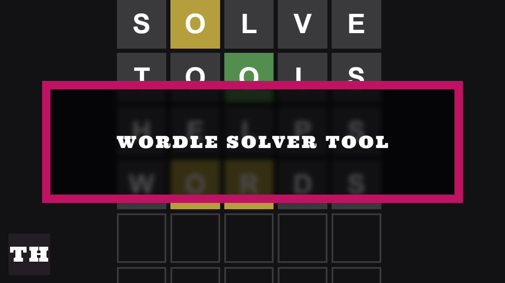

# WordleSolver_ALGO3
# 🎮 Mon Jeu Wordle

Le joueur doit deviner un mot de 5 lettres en 6 essais maximum.  
Chaque tentative donne un indice de couleur :
- G🟩 Lettre correcte et bien placée  
- Y🟨 Lettre correcte mais mal placée  
- (vide)⬜ Lettre absente du mot

- 

